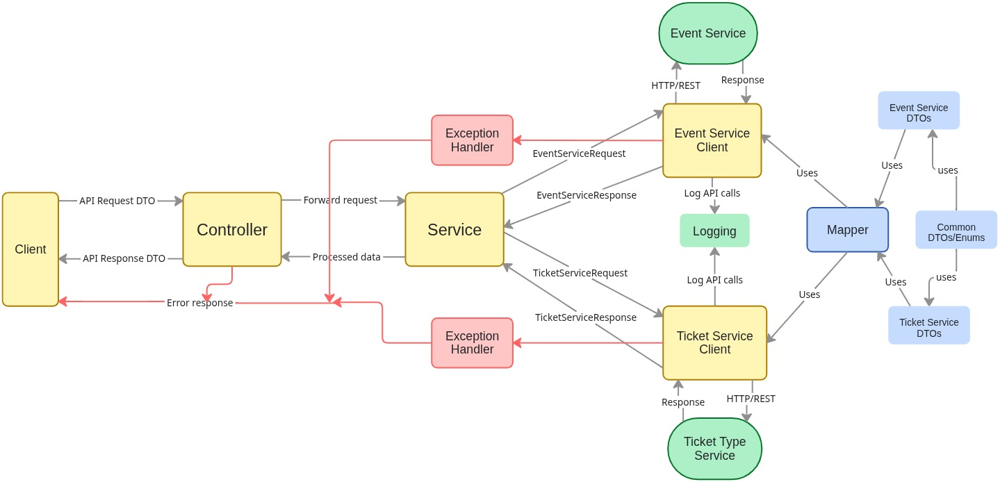

# Orchestrator Service

A service whose only job is to coordinate multiple domain services to fulfill a single business operation.
Creating an event with ticket types is **one business action** — but **two microservices** must act.
That’s what this service does.

This service is the **command and coordination layer** between:

- **Event Service**
- **Ticket Service**

The orchestrator exposes **one clean API** to the outside world and internally calls to multiple microservices, handling:

- Event creation
- Ticket type creation
- Error handling and rollback logic

---



### [ EventForge Full Architecture Design](https://miro.com/app/board/uXjVGVq5l3U=/?moveToWidget=3458764653985736600&cot=14)

---

## API Endpoints

| Method | Endpoint                | What it does                                        | Who actually handles it                |
| ------ | ----------------------- | --------------------------------------------------- | -------------------------------------- |
| POST   | `/api/events`           | Creates an event **and** its ticket types in one go | Orchestrator → Event + Ticket services |
| GET    | `/api/events/{eventId}` | Fetches event details                               | Event Service (via Orchestrator)       |
| PATCH  | `/api/events/{eventId}` | Updates event metadata                              | Event Service (via Orchestrator)       |
| DELETE | `/api/events/{eventId}` | Deletes the event and all related ticket types      | Orchestrator → Event + Ticket services |

> **Note:** Currently only the `POST /api/events` (Create Event) endpoint is implemented; `GET`, `PATCH`, and `DELETE` APIs are under active development and will be added next.

---

## Prerequisites

Before running this service, you must already have following services running inside docker :

| Service             | Purpose              |
| ------------------- | -------------------- |
| **Keycloak**        | Authentication & JWT |
| **Event-Service**   | Event microservice   |
| **Event-database**  | Stores events        |
| **Ticket-Service**  | Ticket microservice  |
| **Ticket-database** | Stores ticket types  |

This service **does not own a database** — it is purely orchestration + API.

### Start infrastructure

Run Keycloak, Postgres, Event Service, and Ticket Service first.
They must be reachable by the orchestrator.

---

## Build / Run

```bash
./gradlew clean build

# Run

./gradlew clean bootRun
```

### The service will be available at:

```
http://localhost:8083
```

---

# 🏗 High Level Flow

When a client calls:

```
POST /api/events
```

The orchestrator performs:

```
Client
  │
  ▼
Orchestrator
  │
  ├──▶ Event Service (create event)
  │          │
  │          └── returns eventId
  │
  └──▶ Ticket Service (create ticket types using eventId)
```

If **any step fails**, the orchestrator knows what happened and can react accordingly.

---

# Project Structure

```
src
└── main
    ├── java
    │   └── com.daroch.orchestrator
    │   ├── client
    │   │   → Low-level WebClient wrappers for other microservices
    │   ├── config
    │   │   → WebClient, Security, JWT, and app configuration
    │   ├── controller
    │   │   → REST API layer (what the outside world calls)
    │   ├── dto
    │   │   ├── api
    │   │   │   → Public API contracts (what frontend sends)
    │   │   │   ├── request
    │   │   │   └── response
    │   │   │
    │   │   ├── eventservice
    │   │   │   → Contracts used when calling Event Service
    │   │   │
    │   │   └── ticketservice
    │   │       → Contracts used when calling Ticket Service
    │   ├── exception
    │   │   → Domain-level exceptions (Event failures, Ticket failures)
    │   ├── logging
    │   │   → Request tracing, correlation IDs, WebClient logging
    │   ├── mapper
    │   │   → Converts API DTOs → service DTOs
    │   └── service
    │       ├── client
    │       │   → Interfaces for external service calls
    │       └── impl
    │           → Orchestration logic (the real brain)
    │
    └── resources
        └── application.yml
```

---

## 🔐 Authentication

All endpoints require a **JWT from Keycloak**.

The orchestrator **forwards the same JWT** to:

- Event Service
- Ticket Service

---

## 👨‍💻 Author

- [@Mukul Daroch](https://github.com/mukuldaroch)
